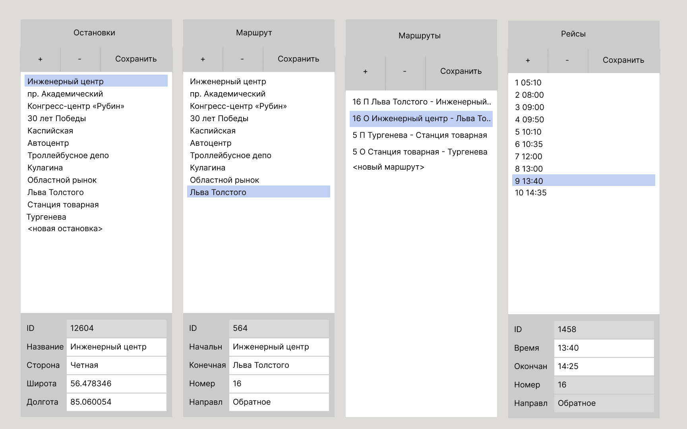

# public-transport-timetable

Учебный проект курса
[Kotlin Backend Developer](https://otus.ru/lessons/kotlin/?int_source=courses_catalog&int_term=programming).

public-transport-timetable -- это сервис расписаний движения общественного транспорта. Задача
сервиса -- это предоставить: для автотранспортных предприятий -- возможность добавления новых рейсов, маршрутов, остановок, 
времени прибытия и отправления и тд, для пассажиров -- актуальную информацию о расписании.

## Визуальная схема фронтенда

## Документация

1. Маркетинг
    1. [Заинтересанты](./docs/01-marketing/02-stakeholders.md)
    2. [Целевая аудитория](./docs/01-marketing/01-target-audience.md)
    3. [Конкурентный анализ](./docs/01-marketing/03-concurrency.md)
    4. [Анализ экономики](./docs/01-marketing/04-economy.md)
    5. [Пользовательские истории](./docs/01-marketing/05-user-stories.md)

2. DevOps
   1. [Схема инфраструктуры](./docs/02-devops/01-infrastruture.md)
   2. [Схема мониторинга](./docs/02-devops/02-monitoring.md)

3. Приемочные тесты - [public-transport-timetable-acceptance](public-transport-timetable-acceptance)

4. Архитектура
   1. [Компонентная схема](./docs/04-architecture/01-arch.md)
   2. [Интеграционная схема](./docs/04-architecture/02-integration.md)
   3. [Описание API](./docs/04-architecture/03-api.md)

# Структура проекта

1. Транспортные модели и мапперы
   1. [specs](specs) - спецификации openapi
   2. [public-transport-timetable-api-v1-jackson](public-transport-timetable-api-v1-jackson) Версия 1, используется jackson
   3. [public-transport-timetable-api-v2-kmp](public-transport-timetable-api-v2-kmp) Версия 2, используется kotlinx serialization
   4. [public-transport-timetable-mappers-v1](public-transport-timetable-mappers-v1) Мапперы из транспортных моделей v1 во внутренние модели
   5. [public-transport-timetable-mappers-v2](public-transport-timetable-mappers-v2) Мапперы из транспортных моделей v2 во внутренние модели

2. Бизнес-логика и внутренние модели
   1. [public-transport-timetable-common](public-transport-timetable-common) Внутренние модели, общие хелперы и интерфейсы
   2. [public-transport-timetable-stubs](public-transport-timetable-stubs) Стабы
   3. [public-transport-timetable-lib-cor](public-transport-timetable-lib-cor) Библиотека для построения бизнес-логики

3. Приложения (точки входа)
   1. [public-transport-timetable-app-common](public-transport-timetable-app-common) Общий код для приложений
   2. [public-transport-timetable-app-ktor](public-transport-timetable-app-ktor) Ktor
   3. [public-transport-timetable-app-kafka](public-transport-timetable-kafka) Kafka

4. Логирование
   1. [specs-ad-log.yaml](specs/specs-trip-log.yaml) Модели логирования (openapi)
   2. [public-transport-timetable-api-log1](public-transport-timetable-api-log1) Модели логирования
   3. [public-transport-timetable-mappers-log1](public-transport-timetable-mappers-log1) Маперы для моделей логирования
   4. [public-transport-timetable-lib-logging-common](public-transport-timetable-lib-logging-common) Интерфейс логирования
   5. [public-transport-timetable-lib-logging-kermit](public-transport-timetable-lib-logging-kermit) Логирование через kermit
   6. [public-transport-timetable-lib-logging-logback](public-transport-timetable-lib-logging-logback) Логирование через logback

5. Репозитарии
   1. [public-transport-timetable-repo-in-memory](public-transport-timetable-repo-in-memory) Репозитарий в памяти
   2. [public-transport-timetable-repo-stubs](public-transport-timetable-repo-stubs) Репозитарий-заглушка
   3. [public-transport-timetable-repo-tests](public-transport-timetable-repo-tests) Проект с тестами для репозитариев
   4. [public-transport-timetable-repo-postgresql](public-transport-timetable-repo-postgresql) Postgresql

## Подпроекты для занятий по языку Kotlin

1. [m1l1-hello](m1l1-hello) - Вводное занятие, создание первой программы на Kotlin
